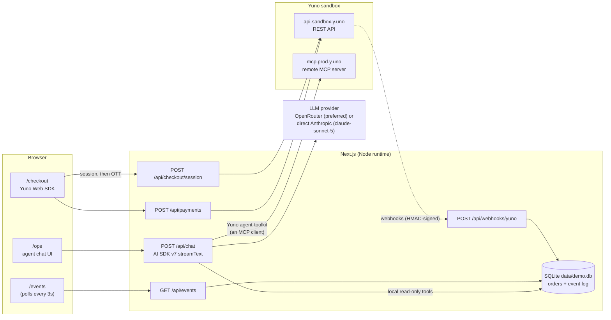

# Montmare Store — Yuno Payments Demo

A one-product storefront ("Montmare Reserva" coffee, R$ 89,00 BRL, Brazil) that runs
real sandbox transactions through [Yuno](https://y.uno), the financial infrastructure
platform — plus an AI **payment-ops agent** built in the Payments Concierge pattern:
it takes autonomous payment-ops actions, but only within configured permissions, with
a confirmation gate on money-moving actions. Built as an onboarding demo for Yuno's
AI engineering team. **Sandbox only — no real cards, ever.**

Three surfaces:

| Route | What it is |
|---|---|
| `/` → `/checkout` | Storefront + Yuno **Seamless Web SDK** checkout (full session → token → payment loop) |
| `/events` | Live webhook log — every notification Yuno sends us, HMAC-verified, polled every 3s |
| `/ops` | Payment Ops Agent — Claude + Yuno agent-toolkit, least-privilege action scoping, human-in-the-loop approval for anything destructive |

## Architecture



Key facts about this shape:

- **All Yuno REST calls go through `yunoFetch()` in `lib/yuno.ts`** — one place for
  auth headers, error typing, and safe logging (`method path -> status`, never keys).
- **SQLite (`lib/db.ts`, better-sqlite3)** holds two things Yuno doesn't: the mapping
  from human names ("Maria's coffee order") to `merchant_order_id`/`payment_id`, and
  the inbound webhook event log. It's a synchronous native module, so every route that
  touches it declares `runtime = "nodejs"`.
- **The Yuno agent-toolkit is not a local SDK — it is an MCP client.**
  `createYunoAgentToolkit()` opens a session against Yuno's remote MCP server
  (`mcp.prod.y.uno`) and every tool call the model makes is a remote MCP call. That
  means the remote MCP constraints — **sessions are IP-bound, ~15 requests/min,
  30-minute idle cap** — apply to our agent too. See "Agent design" below for how the
  app is built around that.
- **Deploy target is a persistent Node host** (Railway/Fly, `next start`). Vercel-style
  serverless breaks the demo: the webhook write and the `/events` read would land in
  different lambdas with different ephemeral filesystems. Local + a `cloudflared`
  tunnel works for demo day.

### Mapping to Yuno's product direction

The `/ops` agent is deliberately shaped like a small Payments Concierge: an agent
that takes payment-ops actions autonomously, but only inside a merchant-configured
permission set. The permissions policy module (`lib/agent/permissions.ts`) plays the
role of that merchant configuration — an explicit, reviewable allowlist plus a
confirmation gate on money-moving actions. The local briefing tool ("summarize
today's payments") is the same idea as Concierge's scheduled briefings, computed
from the merchant's own records rather than a new API surface. On the other side,
the payment-link flow — the agent assembling and handing back a ready-to-pay
`checkout_url` on request — is the buy-side motion behind Agentic Commerce, where an
agent initiates checkout on a user's behalf. Nothing here is a product claim; it's
the same permission-scoped agent architecture, demonstrated end to end on the
sandbox.

## The payment loop

What happens when a buyer pays R$ 89,00, end to end:

1. **Session** — `/checkout` POSTs the buyer's name to `POST /api/checkout/session`.
   The server creates a Yuno customer (`POST /v1/customers`), then a checkout session
   (`POST /v1/checkout/sessions` with `merchant_order_id`, `amount`, `customer_id`,
   `account_id`), and records a local order row (`status: CREATED`).
2. **SDK mount** — the client loads the Seamless SDK:
   `loadScript({ env: "sandbox" })` → `sdk.initialize(publicApiKey)` →
   `startCheckout({ checkoutSession, elementSelector, countryCode: "BR", ... })` →
   `mountCheckout()`. The card form renders inside Yuno's element — raw PAN never
   touches our code.
3. **One-time token** — the Pay button calls `startPayment()`. The SDK tokenizes the
   card and hands us a one-time token (OTT) via the `createPayment(oneTimeToken)`
   callback.
4. **Server-side payment** — the client POSTs the OTT to `POST /api/payments`, which
   calls `POST /v1/payments` with `checkout: { session }`,
   `payment_method: { token }`, `workflow: "SDK_CHECKOUT"`, and a fresh UUID in
   `X-Idempotency-Key`.
5. **`sdk_action_required` branch** — if the response says the SDK has more work to do
   (3DS challenge, APM redirect, PIX QR), the client calls
   `yuno.continuePayment({ showPaymentStatus: true })` and waits for the
   `paymentResult(status)` callback. Otherwise it goes straight to
   `/checkout/result`.
6. **Webhook** — asynchronously, Yuno POSTs `payment.purchase` / `payment.refund` /
   etc. to `/api/webhooks/yuno`. The handler verifies the HMAC over the **raw** body,
   dedupes on `data.idempotency_key` (`INSERT OR IGNORE`), updates the order row, and
   always ACKs fast (Yuno retries up to 7× on non-200, so even malformed payloads are
   logged and answered with 200).

Two gotchas that will bite anyone integrating for the first time:

- **Amounts are decimal major units.** BRL 89.00 is `{ "currency": "BRL", "value": 89 }` —
  **not** 8900 cents. The quickstart's `"value": "2500"` example reads like minor
  units; the API reference ("multiple of 0.0001") is the ground truth. Get this wrong
  and you charge 100× the price.
- **Auth is a two-header pair.** Every backend call sends **both** `public-api-key`
  and `private-secret-key` headers — not Bearer, not Basic. The frontend SDK gets only
  the public key. `yunoFetch()` is the single place this pair is assembled, and it
  never logs header values.

## Agent design

The `/ops` agent holds refund power, so it is scoped and gated like a production
credential, not like a chatbot. It acts within configured permissions — the Payments
Concierge pattern — and every deviation path is closed by construction.

### Least-privilege action scoping: an explicit allowlist

The toolkit exposes an `ALL_TOOLS_ENABLED` constant. We deliberately don't use it.
The permissions policy module, `lib/agent/permissions.ts`, passes an explicit
allowlist (`PERMISSIONS`) so everything not listed is invisible to the model — it
can't be prompted, jailbroken, or hallucinated into calling a tool it was never
given:

- `customers`: create, retrieve
- `payments`: retrieve, retrieveByMerchantOrderId, refund, cancelOrRefund
- `paymentLinks`: create, retrieve, cancel
- `subscriptions`: create, retrieve, pause, resume, cancel
- plus **local, read-only** tools over SQLite: `searchOrders` and
  `listRecentOrders` resolve "Maria's coffee order" to real Yuno IDs, and
  `paymentsBriefing` answers "summarize today's payments" by aggregating order
  count, approved/declined split, decline reasons, and approved/refunded volume
  from local records — a Concierge-style briefing with no new Yuno API surface

Notably absent: **`payments.create` / `authorize` / `capture`**. An ops agent that can
refund money has no business charging cards. If the demo ever needs that, it's a
one-line, code-reviewed diff to the allowlist — which is exactly the point.

### Confirmation gate on money-moving actions, enforced server-side

Every money-moving tool — the `REQUIRES_CONFIRMATION` list in
`lib/agent/permissions.ts`: `paymentRefund`, `paymentCancelOrRefund`,
`paymentLinkCancel`, `subscriptionPause`, `subscriptionCancel` — is marked
`"user-approval"` via AI SDK v7's native `toolApproval` (`buildToolApproval()`). This is enforced in the server-side agent loop, not in UI code: the core
pauses the run, streams an approval request to the client, and **will not invoke the
tool's `execute()` until an explicit `approved: true` response round-trips**. A denial
produces an `output-denied` part and the run continues without the call. A malicious
or buggy client that never answers simply leaves the tool un-executed.

The gate also **fails closed**: beyond the exact-name list, any tool matching
`/refund|cancel|pause|unenroll|delete/i` is gated by default. If a future toolkit
version renames or adds a destructive tool, it gets a Confirm button — not silent
execution.

### Visibility, prompt hygiene, lifecycle

- **Every tool call is visible.** The `/ops` UI renders each call as a card — tool
  name, collapsible input/result JSON, state (running / done / error / denied), and a
  "gated" marker — plus a sidebar listing the full enabled-scope allowlist. The
  audience watches the agent work; nothing happens off-screen.
- **The system prompt is a versioned file**, `lib/agent/system-prompt.md`, loaded per
  request — prompt changes are reviewable diffs, not string edits buried in code. It
  encodes the operating rules: resolve names via local tools first, re-verify payment
  state with Yuno before acting, never invent IDs, re-retrieve after money moves,
  stop on errors, never argue past a denial.
- **Provider portability.** Model selection is resolved per request in
  `lib/agent/model.ts`: OpenRouter when `OPENROUTER_API_KEY` is set (default
  `anthropic/claude-sonnet-5`), direct Anthropic as fallback. The permissions
  policy, confirmation gate, and toolkit are provider-agnostic — swapping the
  model vendor for this financial infrastructure platform demo is an env-var
  change, not a code change.
- **Per-request toolkit lifecycle.** `POST /api/chat` builds the toolkit (which opens
  an MCP session), and closes it on finish, abort, and error. Fresh session per
  request keeps the remote MCP's IP-binding harmless in practice, and
  `stopWhen: stepCountIs(10)` caps any single run well under the ~15 req/min remote
  limit. A stable-egress deploy host is still preferred over roaming laptop IPs.

## Setup

```bash
npm install
cp .env.local.example .env.local   # then fill it in
npm run seed                       # 3 named sandbox orders for the agent demo
npm run dev                        # http://localhost:3000
```

### Environment variables (`.env.local`)

| Variable | What it is |
|---|---|
| `YUNO_ACCOUNT_CODE` | Account id, used as `account_id` in sessions/payments |
| `YUNO_PUBLIC_API_KEY` | Public API key (server-side half of the header pair) |
| `NEXT_PUBLIC_YUNO_PUBLIC_API_KEY` | Same value — exposed to the browser for the Web SDK |
| `YUNO_PRIVATE_SECRET_KEY` | Private secret key. Server-only, never logged, never sent to the client |
| `YUNO_WEBHOOK_SECRET` | HMAC secret for webhook signature verification |
| `OPENROUTER_API_KEY` | Preferred — routes the `/ops` agent through OpenRouter (default model `anthropic/claude-sonnet-5`) |
| `ANTHROPIC_API_KEY` | Fallback — direct Anthropic for the `/ops` agent, used only when `OPENROUTER_API_KEY` is unset |
| `AGENT_MODEL` | Optional model override for the `/ops` agent (OpenRouter or Anthropic id, depending on active provider) |
| `YUNO_API_URL` | Defaults to `https://api-sandbox.y.uno` — keep it pointed at sandbox |

Keys come from the Yuno dashboard → **Developers → API keys**, **sandbox**
environment. The build intentionally does not require `.env.local` — env is read
lazily at request time, and missing creds surface as clean 500 JSON errors.

### Webhooks

1. Expose the app. Locally: `cloudflared tunnel --url http://localhost:3000`
   (the free tunnel URL changes on every run).
2. Yuno dashboard → **Developers → Webhooks** → add the endpoint:
   `<your-origin>/api/webhooks/yuno`, and select the payment events.
3. Enable the **HMAC signature** checkbox, copy the secret into
   `YUNO_WEBHOOK_SECRET`, and restart the dev server.
4. Buy a coffee; watch `/events`. Each row shows `signature_valid` — `1` verified,
   `0` rejected (answered 401), `null` unchecked (no secret/header configured).

### Sandbox test data

Card `4507 9900 0000 0002`, expiry `11/28`, CVV `123`, holder `John Doe`. The
BR checkout form also requires a document type + CPF — use `529.982.247-25`.

**Declines are not reproducible on this account** (verified live 2026-07-19).
Yuno's Testing Gateway publishes decline cards (`…0010` INSUFFICIENT_FUNDS,
`…0028` DECLINED_BY_BANK, `…0036` DO_NOT_HONOR), but this account routes to
live provider sandboxes with failover: we observed Adyen refuse → Stripe
refuse → Checkout.com approve the same "declined" card, and Checkout.com's
sandbox approves any Luhn-valid, unexpired card. An expired expiry (`11/20`)
is refused by every provider, so it is the only deterministic decline — and
only via the API, since the Web SDK validates expiry client-side and blocks
submission. Hence `scripts/seed.ts` uses an expired card for its declined
example, and the demo narrates declines rather than clicking one.

`npm run seed` creates Maria Silva and João Santos (succeeded payments, refundable)
and Ana Oliveira (declined on purpose — the agent's "should refuse to refund this"
example).

## Repo map

- `lib/yuno.ts` — Yuno REST client (auth pair, typed wrappers, safe logging)
- `lib/db.ts` — SQLite store: orders + webhook event log
- `lib/agent/` — the ops agent: `permissions.ts` (permissions policy: allowlist +
  approval gate), `toolkit.ts` (per-request MCP toolkit lifecycle),
  `local-tools.ts` (read-only DB tools incl. the payments briefing),
  `system-prompt.md`
- `app/api/` — `checkout/session`, `payments`, `webhooks/yuno`, `events`, `chat`
- `app/` — storefront, `/checkout`, `/checkout/result`, `/events`, `/ops`
- `scripts/seed.ts` — sandbox seed data
- `CONTEXT.md` — recon findings from the Yuno docs (with unverified items marked ⏳)
- `DEMO.md` — the 5-minute presentation runbook
